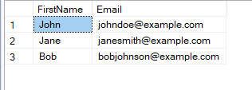
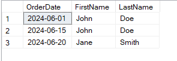
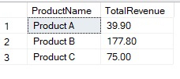

-- Create the Customers table
CREATE TABLE Customers (
    CustomerID INT PRIMARY KEY,
    FirstName VARCHAR(50),
    LastName VARCHAR(50),
    Email VARCHAR(100),
    Phone VARCHAR(20),
    Address VARCHAR(100)
);

-- Create the Products table
CREATE TABLE Products (
    ProductID INT PRIMARY KEY,
    ProductName VARCHAR(100),
    Description VARCHAR(200),
    Price DECIMAL(10, 2)
);

-- Create the Orders table
CREATE TABLE Orders (
    OrderID INT PRIMARY KEY,
    CustomerID INT,
    OrderDate DATE,
    TotalAmount DECIMAL(10, 2),
    FOREIGN KEY (CustomerID) REFERENCES Customers(CustomerID)
);

-- Create the OrderDetails table
CREATE TABLE OrderDetails (
    OrderDetailID INT PRIMARY KEY,
    OrderID INT,
    ProductID INT,
    Quantity INT,
    FOREIGN KEY (OrderID) REFERENCES Orders(OrderID),
    FOREIGN KEY (ProductID) REFERENCES Products(ProductID)
);

-- Create the Inventory table
CREATE TABLE Inventory (
    InventoryID INT PRIMARY KEY,
    ProductID INT,
    QuantityInStock INT,
    LastStockUpdate DATE,
    FOREIGN KEY (ProductID) REFERENCES Products(ProductID)
);

-- Insert data into the Customers table
INSERT INTO Customers (CustomerID, FirstName, LastName, Email, Phone, Address)
VALUES
    (1, 'John', 'Doe', 'johndoe@example.com', '123-456-7890', '123 Main St'),
    (2, 'Jane', 'Smith', 'janesmith@example.com', '987-654-3210', '456 Elm St'),
    (3, 'Bob', 'Johnson', 'bobjohnson@example.com', '555-555-5555', '789 Oak St');

-- Insert data into the Products table
INSERT INTO Products (ProductID, ProductName, Description, Price)
VALUES
    (1, 'Product A', 'This is product A', 10.99),
    (2, 'Product B', 'This is product B', 20.99),
    (3, 'Product C', 'This is product C', 30.99);

-- Insert data into the Orders table
INSERT INTO Orders (OrderID, CustomerID, OrderDate, TotalAmount)
VALUES
    (1, 1, '2024-06-01', 100.00),
    (2, 1, '2024-06-15', 200.00),
    (3, 2, '2024-06-20', 300.00);

-- Insert data into the OrderDetails table
INSERT INTO OrderDetails (OrderDetailID, OrderID, ProductID, Quantity)
VALUES
    (1, 1, 1, 2),
    (2, 1, 2, 3),
    (3, 2, 1, 1),
    (4, 2, 3, 2),
    (5, 3, 2, 4);

-- Insert data into the Inventory table
INSERT INTO Inventory (InventoryID, ProductID, QuantityInStock, LastStockUpdate)
VALUES
    (1, 1, 10, '2024-06-01'),
    (2, 2, 20, '2024-06-01'),
    (3, 3, 30, '2024-06-01'); 

--Retrieve the names and emails of all customers: 
SELECT FirstName, Email
FROM Customers;  

--List all orders with their order dates and corresponding customer names:sql
SELECT o.OrderDate, c.FirstName, c.LastName
FROM Orders o
JOIN Customers c ON o.CustomerID = c.CustomerID;

-- Insert a new customer record into the "Customers" table:
INSERT INTO Customers (FirstName, LastName, Email, Phone, Address)
VALUES ('John1', 'Doe1', 'johndoe1@example.com', '123-123-7890', '456 Main St'); 

--Update the prices of all electronic gadgets in the "Products" table by increasing them by 10%: 
UPDATE Products
SET Price = Price * 1.1; 

-- Delete a specific order and its associated order details from the "Orders" and "OrderDetails" tables: 

DELETE o ,  od
FROM Orders o
JOIN OrderDetails od ON o.OrderID = od.OrderID
WHERE o.OrderID = 123; 

-- Insert a new order into the "Orders" table: 
INSERT INTO Orders (CustomerID, OrderDate, TotalAmount)
VALUES (1, '2024-06-01', 100);	

-- Update the contact information (e.g., email and address) of a specific customer in the "Customers" table:

UPDATE Customers
SET Email = 'newemail@example.com', Address = 'New Address'
WHERE CustomerID = 1;

-- Recalculate and update the total cost of each order in the "Orders" table:

UPDATE Orders
SET TotalAmount = (
    SELECT SUM(od.Quantity * p.Price)
    FROM OrderDetails od
    JOIN Products p ON od.ProductID = p.ProductID
    WHERE od.OrderID = Orders.OrderID
); 

-- Delete all orders and their associated order details for a specific customer from the "Orders" and "OrderDetails" tables:

DELETE o, od
FROM Orders o
JOIN OrderDetails od ON o.OrderID = od.OrderID
WHERE o.CustomerID = 1;  

-- Insert a new electronic gadget product into the "Products" table: 

INSERT INTO Products (ProductName, Description, Price)
VALUES ('New Product', 'This is a new product', 50);  

-- Update the status of a specific order in the "Orders" table:

UPDATE Orders
SET OrderStatus = 'Shipped'
WHERE OrderID = 123; 

-- Calculate and update the number of orders placed by each customer in the "Customers" table: 

UPDATE Customers
SET OrderCount = (
    SELECT COUNT(*)
    FROM Orders
    WHERE Orders.CustomerID = Customers.CustomerID
); 

-- Retrieve a list of all orders along with customer information for each order: 

SELECT o.OrderDate, c.FirstName, c.LastName
FROM Orders o
JOIN Customers c ON o.CustomerID = c.CustomerID; 

-- Find the total revenue generated by each electronic gadget product: 

SELECT p.ProductName, SUM(od.Quantity * p.Price) AS TotalRevenue
FROM OrderDetails od
JOIN Products p ON od.ProductID = p.ProductID
GROUP BY p.ProductName; 

-- List all customers who have made at least one purchase:

SELECT FirstName, LastName, Email
FROM Customers
WHERE CustomerID IN (
    SELECT CustomerID
    FROM Orders
);

